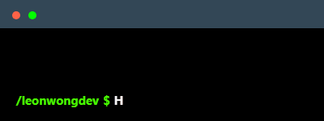

# Hi there, I am Lap Wang 👋

  

## Projects & Live Demo
- [Note taking app for youtube](https://github.com/leonwongdev/youtube-notes-react)
- [.Net Core 8 backend for the note taking app](https://github.com/leonwongdev/youtube-notes-api)
- [Space Travel Web Game](https://github.com/leonwongdev/css-spaceship-game)
- [Sports Facilities Finder for Hong Kong (Android)](https://github.com/leonwongdev/SportsFacilitiesFinderHK-Android)

## 🌱 About me

- I am currently enrolled in the Web Development program at Humber College
- Tech stack: Javascript, React, C#, .Net
- I like playing FPS games
- I like sushi, ice cream, hot pot

## 💡 Skills

## Contacts

## 🔥 My Stats :

